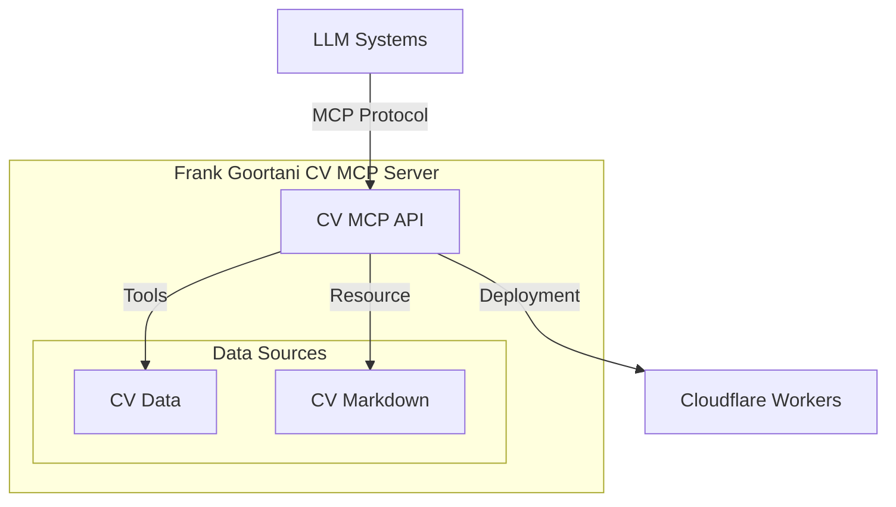

# Frank Goortani CV MCP Server


A Model Context Protocol (MCP) server specifically designed to serve Frank Goortani's CV information. This server provides structured access to CV data, enabling AI assistants and other MCP-compatible clients to retrieve, search, and present professional information in a standardized format.

## Project Overview

### Purpose

This project implements an MCP server that exposes Frank Goortani's curriculum vitae information through a standardized interface. The server allows AI assistants and MCP-compatible applications to access structured CV data, including professional profile, skills, work experience, and more.

### Architecture Overview

The project is built using the FastMCP framework and follows the Model Context Protocol specification. It's designed with a modular architecture:

- **Core Module**: Contains data structures, tool implementations, and resource definitions
- **Server Module**: Provides transport handlers for stdio and HTTP communication
- **Deployment**: Configured for seamless deployment to Cloudflare Workers



### Key Features

- **CV Data Access**: Structured access to profile information, skills, interests, and work experience
- **Markdown Resource**: Full CV available as a markdown resource
- **Search Capabilities**: Text search across all CV sections
- **Company Experience Filtering**: Targeted retrieval of experience at specific companies
- **Media Access**: Direct links to resume PDF and profile picture
- **Deployment Ready**: Configured for Cloudflare Workers deployment
- **Dual Transport**: Support for both stdio (local) and HTTP (remote) communication

## Resources and Tools

### Available Resources

| URI | Description | Type |
|-----|-------------|------|
| `cv://frankgoortani` | Frank Goortani's complete CV in markdown format | text/markdown |


### Available Tools

#### `get_profile`

Returns Frank Goortani's profile information including name, title, and professional description.

- **Parameters**: None
- **Returns**: JSON object with profile information

Example:

```javascript
// Request
const result = await client.callTool("get_profile", {});

// Response
{
  "name": "Frank Goortani",
  "title": "Hands on Solution Architect | LLM, Web, Cloud, Mobile, Strategy",
  "certifications": ["TOGAF", "PMP"],
  "email": "frank@goortani.com",
  "description": "Visionary technology executive and AI leader with over 25 years of experience..."
}
```

#### `get_skills`

Returns a list of Frank Goortani's professional skills.

- **Parameters**: None
- **Returns**: JSON array of skills

Example:

```javascript
// Request
const result = await client.callTool("get_skills", {});

// Response
[
  "Distributed Systems, API platforms, Microservices, integrations, Workflow systems",
  "Generative AI, Large Language Models (LLMs), AI agents, AI automation, Machine Learning",
  "Reactive and Functional Programming in Go, Python, Java, Swift, Typescript and JavaScript",
  // ...additional skills
]
```

#### `get_interests`

Returns a list of Frank Goortani's professional interests.

- **Parameters**: None
- **Returns**: JSON array of interests

Example:

```javascript
// Request
const result = await client.callTool("get_interests", {});

// Response
[
  "Startups", "GoLang", "Python", "Typescript", "LangChain", "LLMs", "Microservices", "MCPs"
]
```

#### `search_cv`

Searches throughout the CV for specific terms and returns matching sections.

- **Parameters**:
  - `query` (string): The search term to look for in the CV
- **Returns**: JSON object with matching sections

Example:

```javascript
// Request
const result = await client.callTool("search_cv", {
  query: "generative ai"
});

// Response
{
  "matches": [
    {
      "section": "profile",
      "content": "Visionary technology executive and AI leader with over 25 years of experience driving strategic innovation in generative AI..."
    },
    {
      "section": "skills",
      "content": "Generative AI, Large Language Models (LLMs), AI agents, AI automation, Machine Learning"
    }
    // ...additional matches
  ]
}
```

#### `get_company_experience`

Retrieves work experience at a specific company.

- **Parameters**:
  - `company` (string): Company name to get experience for
- **Returns**: JSON object with matching experiences. Throws `UserError` if none found.

Example:

```javascript
// Request
const result = await client.callTool("get_company_experience", {
  company: "Uber"
});

// Response
{
  "experiences": [
    {
      "company": "Uber",
      "period": "2021-now",
      "title": "Solution Architect",
      "highlights": [
        "Worked on UDE (User Data Extraction) and DSAR (Data Subject Access Request) Automation...",
        // ...additional highlights
      ]
    }
  ]
}
```

#### `get_resume_link`

Returns the URL to Frank Goortani's resume PDF.

- **Parameters**: None
- **Returns**: JSON object with resume URL

Example:

```javascript
// Request
const result = await client.callTool("get_resume_link", {});

// Response
{
  "resumeLink": "media/Frank Goortani Resume--solution-architect-2024.pdf"
}
```

#### `get_profile_picture`

Returns the URL to Frank Goortani's profile picture.

- **Parameters**: None
- **Returns**: JSON object with profile picture URL

Example:

```javascript
// Request
const result = await client.callTool("get_profile_picture", {});

// Response
{
  "pictureLink": "media/frankgoortani.png"
}
```

## Deployment Instructions

### Prerequisites

- [Bun](https://bun.sh/) or [Node.js](https://nodejs.org/) (v18+)
- [Wrangler CLI](https://developers.cloudflare.com/workers/wrangler/install-and-update/) (for Cloudflare deployment)
- Cloudflare account (for deployment)

### Local Development

1. Clone the repository
   ```bash
   git clone <repository-url>
   cd cv-mcp
   ```

2. Install dependencies
   ```bash
   # Using Bun (recommended)
   bun install
   # OR using npm
   npm install
   ```

3. Start the server locally with stdio transport (for CLI tools)
   ```bash
   # Using Bun
   bun start
   # OR using npm
   npm start
   ```

4. Start the server locally with HTTP transport (for web applications)
   ```bash
   # Using Bun
   bun run start:http
   # OR using npm
   npm run start:http
   ```

5. For development with auto-reload
   ```bash
   # Using Bun with stdio transport
   bun run dev
   # Using Bun with HTTP transport
   bun run dev:http
   ```

### Cloudflare Deployment

1. Login to your Cloudflare account
   ```bash
   wrangler login
   ```

2. Update wrangler.toml if needed

   The configuration is already set up in the `wrangler.toml` file. You may want to customize:
   - Custom domain routes
   - Environment variables
   - KV namespace connections

3. Deploy to Cloudflare
   ```bash
   # Deploy to production
   npm run deploy

   # OR deploy to development environment
   npm run deploy:dev
   ```

4. For local testing of Cloudflare Worker
   ```bash
   npm run dev:cf
   ```

### Environment Configuration

The project uses the following environment variables that can be configured:

- `PORT`: HTTP port for local development (default: 3001)
- `HOST`: Host binding for HTTP server (default: 0.0.0.0)
- `ENVIRONMENT`: Current environment (development/production)
- `API_KEY`: API key required in the `x-api-key` header for all requests

In Cloudflare, these variables are configured in the `wrangler.toml` file:

```toml
[vars]
ENVIRONMENT = "production"

[env.dev.vars]
ENVIRONMENT = "development"
```

## Usage Examples

### Connecting to the Server

#### Connecting from a CLI MCP Client

```bash
# Connect via stdio transport
npx fastmcp dev "bun run start"

# Connect via HTTP transport
npx fastmcp connect http://localhost:3001/sse -H "x-api-key:<your-api-key>"
```

Make sure to replace `<your-api-key>` with the value of the `API_KEY` environment variable.

#### Connecting from Cursor

1. Open Cursor and go to Settings
2. Click on "Features" in the left sidebar
3. Scroll down to "MCP Servers" section
4. Click "Add new MCP server"
5. Enter the following details:
   - Server name: `frank-cv-mcp`
   - For stdio mode:
     - Type: `command`
     - Command: `bun run start`
   - For SSE mode:
     - Type: `url`
     - URL: `http://localhost:3001/sse`
6. Click "Save"

#### Using mcp.json with Cursor

```json
{
  "mcpServers": {
    "frank-cv-stdio": {
      "command": "bun",
      "args": ["run", "start"],
      "env": {
        "NODE_ENV": "development"
      }
    },
    "frank-cv-sse": {
      "url": "http://localhost:3001/sse"
    }
  }
}
```

### Sample Request Flows

#### Retrieving Basic Information

```javascript
// Get profile information
const profile = await client.callTool("get_profile", {});

// Get skills list
const skills = await client.callTool("get_skills", {});

// Get the CV as a markdown document
const cvMarkdown = await client.accessResource("cv://frankgoortani");
```

#### Searching for Specific Experience

```javascript
// Search for AI experience
const aiExperience = await client.callTool("search_cv", {
  query: "ai"
});

// Get specific company experience
const uberExperience = await client.callTool("get_company_experience", {
  company: "Uber"
});
```

#### Getting Media Links

```javascript
// Get resume PDF link
const resumeLink = await client.callTool("get_resume_link", {});

// Get profile picture link
const pictureLink = await client.callTool("get_profile_picture", {});
```

## Running with Docker

This project can be run inside a Docker container, which is useful for deployment on platforms like Synology NAS or other container orchestration systems.

### Prerequisites

- [Docker](https://www.docker.com/get-started) installed on your system.

### Building the Docker Image

1.  Navigate to the project root directory (where the `Dockerfile` is located).
2.  Run the following command to build the Docker image. Replace `cv-mcp` with your desired image name if needed.

    ```bash
    docker build -t cv-mcp .
    ```

### Running the Docker Container

1.  Once the image is built, you can run it as a container. The application inside the container listens on port 3001. You need to map a port from your host machine to the container's port 3001.

    ```bash
    docker run -d -p 8080:3001 --name cv-mcp-container cv-mcp
    ```

    - `-d`: Runs the container in detached mode (in the background).
    - `-p 8080:3001`: Maps port 8080 on your host machine to port 3001 inside the container. You can change `8080` to any available port on your host.
    - `--name cv-mcp-container`: Assigns a name to the running container for easier management.
    - `cv-mcp`: Specifies the image to run.

2.  After running the container, the MCP server should be accessible. If you mapped host port 8080, the SSE endpoint would typically be `http://localhost:8080/sse`.

3.  For deployment on Synology NAS, you would typically use the Synology Docker UI or command line to run the container, mapping the appropriate host port. The target URL for accessing the service via reverse proxy would be `https://mcp.goortani.synology.me/`. Ensure your reverse proxy is configured to forward requests to the host port you mapped (e.g., 8080).

### Stopping and Removing the Container

-   To stop the container:
    ```bash
    docker stop cv-mcp-container
    ```
-   To remove the container (after stopping):
    ```bash
    docker rm cv-mcp-container
    ```

## License

This project is licensed under the MIT License.
